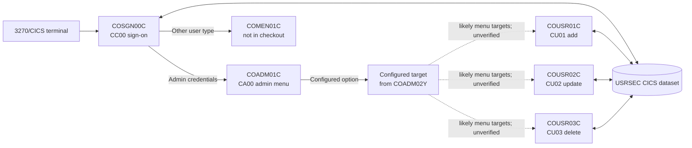
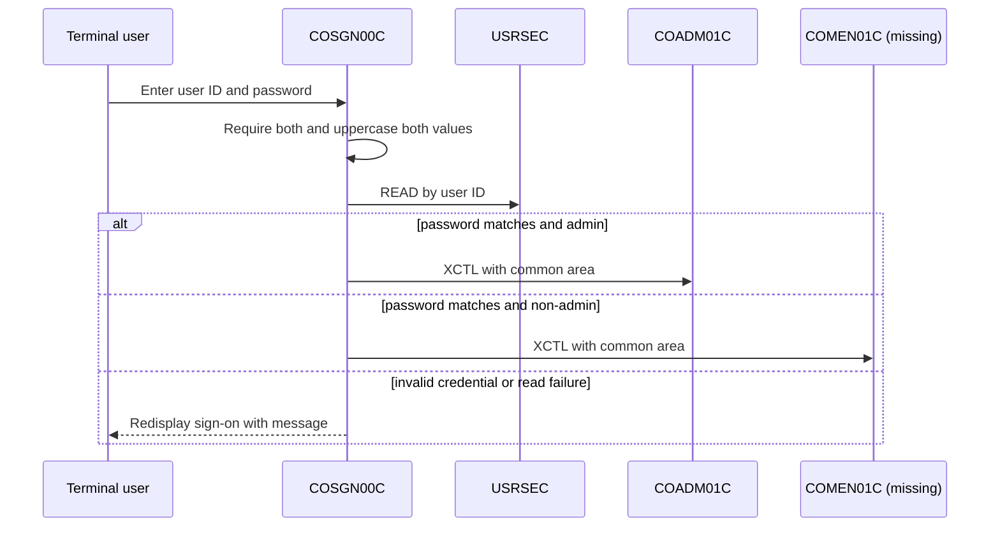
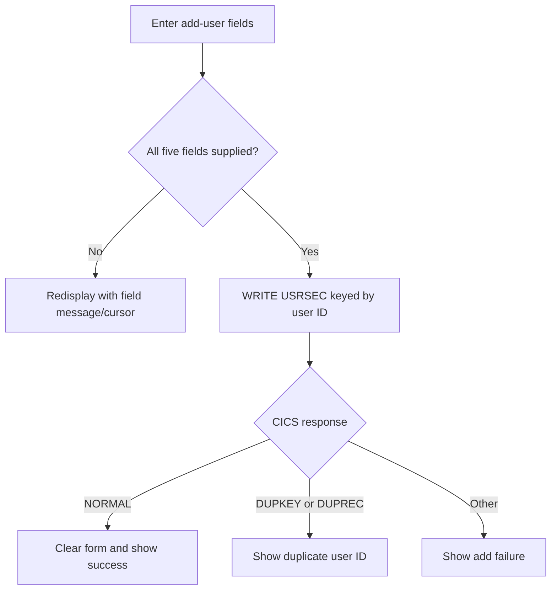

# CardDemo user-security slice — Phase 0 codebase wiki

## Scope and evidence

This repository contains five COBOL sources: one sign-on program, an administrator menu, and three `USRSEC` user-maintenance programs. The programs identify themselves as CardDemo CICS COBOL programs and state their respective functions in their headers. [COSGN00C.cbl:2-6] [COADM01C.cbl:2-6] [COUSR01C.cbl:2-6] [COUSR02C.cbl:2-6] [COUSR03C.cbl:2-6]

This is an orientation artifact, not a complete application specification. Every observation below is derived from the checked-in program text. The repository does **not** include any copybooks or BMS map sources; consequently, copied record layouts, map field attributes, menu option contents, title/message constants, and the exact `USRSEC` record layout cannot be verified from this checkout. The referenced-but-absent artifacts are identified in [Shared dependencies and limitations](#shared-dependencies-and-limitations).

## Executive overview

The available slice implements interactive CICS screens for authentication and administrator-managed user records. `COSGN00C` reads a user-security dataset and routes an authenticated user by type: admins go to `COADM01C`; non-admins go to `COMEN01C`, which is not present here. [COSGN00C.cbl:211-257]

`COADM01C` displays a copybook-configured admin menu, validates a numeric selection, and transfers to the configured program unless its name begins with `DUMMY`; otherwise it displays “coming soon.” [COADM01C.cbl:117-155] The three `COUSR` programs provide create, retrieve/update, and retrieve/delete interactions against the same CICS dataset, `USRSEC`. [COUSR01C.cbl:35-56] [COUSR02C.cbl:35-68] [COUSR03C.cbl:35-68]

## Architecture and components

* The sign-on program uses transaction ID `CC00`; the admin menu uses `CA00`; the add, update, and delete programs use `CU01`, `CU02`, and `CU03`, respectively. [COSGN00C.cbl:35-46] [COADM01C.cbl:35-48] [COUSR01C.cbl:35-45] [COUSR02C.cbl:35-47] [COUSR03C.cbl:35-47]
* Each program receives a variable-length `DFHCOMMAREA` whose effective length is controlled by `EIBCALEN`. [COSGN00C.cbl:64-67] [COADM01C.cbl:66-69] [COUSR01C.cbl:62-65] [COUSR02C.cbl:73-76] [COUSR03C.cbl:73-76]
* The application state contract is supplied by `COCOM01Y`. The sources use it for re-entry state, origin/destination program and transaction, user ID/type, and program context, but its definition is unavailable. [COADM01C.cbl:50-60] [COSGN00C.cbl:48-58] [COUSR01C.cbl:46-56]
* The admin menu’s destination program names and option labels/count are supplied by missing copybook `COADM02Y`; no menu-to-program mapping can be confirmed from these five files. [COADM01C.cbl:50-61] [COADM01C.cbl:127-155] [COADM01C.cbl:226-263]

### CICS interaction pattern

The programs follow the normal pseudo-conversational pattern: on first entry they initialise/send a BMS map; on re-entry they receive input, process an attention key, then `RETURN` with the transaction ID and common area. [COADM01C.cbl:82-110] [COUSR01C.cbl:78-110] [COUSR02C.cbl:90-138] [COUSR03C.cbl:90-137] The sign-on program follows the same `RETURN` approach but begins with no common area and directly receives its map on the later transaction. [COSGN00C.cbl:80-102] [COSGN00C.cbl:108-115]

## Program guide

### `COSGN00C` — sign-on (`CC00`)

**Purpose and inputs.** The program displays map `COSGN0A` in mapset `COSGN00`, taking a user ID and password. A first invocation clears the output map and positions the cursor at the user-ID input. [COSGN00C.cbl:80-83] [COSGN00C.cbl:110-115] [COSGN00C.cbl:145-157]

**Behavior.**

1. `ENTER` requires both fields; it redisplays the screen and positions the relevant cursor if either is blank or low values. [COSGN00C.cbl:117-130]
2. It uppercases both submitted values, stores the ID in the shared common area, and reads `USRSEC` using the user ID as an eight-character key. [COSGN00C.cbl:132-140] [COSGN00C.cbl:209-219]
3. On a normal read, it compares the stored password with the uppercased submitted password. A match populates shared origin/user/context fields and transfers to `COADM01C` for an admin type or `COMEN01C` otherwise. [COSGN00C.cbl:221-240]
4. A password mismatch, response code 13, or another read response returns a tailored retry message; response code 13 is treated as “User not found.” [COSGN00C.cbl:241-257]
5. PF3 sends a “thank you” text response and performs a CICS return; unsupported keys redisplay the sign-on map with the common invalid-key message. [COSGN00C.cbl:85-95] [COSGN00C.cbl:160-172]

**Screen header.** The header derives date/time from `CURRENT-DATE` and assigns CICS application and system IDs to the map output. [COSGN00C.cbl:177-204]

### `COADM01C` — administrator menu (`CA00`)

**Purpose and screen.** The program sends and receives map `COADM1A` in mapset `COADM01`. It formats the header and up to ten visible option slots from the copybook-provided menu arrays. [COADM01C.cbl:172-221] [COADM01C.cbl:226-263]

**Behavior.**

1. If invoked without a common area it returns to sign-on; otherwise first entry marks the program as re-entered, clears the output map, and shows the menu. [COADM01C.cbl:82-105]
2. On `ENTER`, it trims trailing spaces from the option input, replaces remaining blanks with zeroes, and converts the result to its numeric working field. [COADM01C.cbl:117-126]
3. It rejects nonnumeric, zero, and out-of-range selections against `CDEMO-ADMIN-OPT-COUNT`. [COADM01C.cbl:127-135]
4. For a valid option whose configured target does not start with `DUMMY`, it sets caller/context details and `XCTL`s to that target; a `DUMMY` target produces the “coming soon” response instead. [COADM01C.cbl:137-155]
5. PF3 routes to sign-on; any other unsupported key yields the shared invalid-key message. [COADM01C.cbl:93-103] [COADM01C.cbl:160-167]

### `COUSR01C` — add user (`CU01`)

**Purpose and screen.** This program sends and receives `COUSR1A` in mapset `COUSR01`, and declares its function as adding a Regular/Admin user to `USRSEC`. [COUSR01C.cbl:2-6] [COUSR01C.cbl:184-209]

**Behavior.**

1. A direct call with no common area sends the user to sign-on. On a normal first entry it clears the map and sets the cursor to first name. [COUSR01C.cbl:78-87]
2. On `ENTER`, it requires first name, last name, user ID, password, and user type. Each failed check returns an explicit message and focuses the failing field. [COUSR01C.cbl:115-151]
3. On valid input, it moves all five values into the `SEC-USR-*` record fields and writes the record to `USRSEC`, keyed by `SEC-USR-ID`. [COUSR01C.cbl:153-160] [COUSR01C.cbl:238-248]
4. A normal write clears the form and reports success. `DUPKEY`/`DUPREC` reports that the user ID already exists; other failures report that the user could not be added. [COUSR01C.cbl:250-274]
5. PF3 transfers to `COADM01C`; PF4 clears the current form; other keys yield an invalid-key message. [COUSR01C.cbl:89-103] [COUSR01C.cbl:276-295]

### `COUSR02C` — look up and update user (`CU02`)

**Purpose and screen.** This program sends and receives `COUSR2A` in mapset `COUSR02`. Its header says it updates a `USRSEC` user. [COUSR02C.cbl:2-6] [COUSR02C.cbl:264-291]

**Selection and navigation.** It optionally preloads the input user ID from `CDEMO-CU02-USR-SELECTED`, a shared common-area extension declared locally, then retrieves the record. PF3 saves via `UPDATE-USER-INFO` before returning to the previous program, PF5 saves without leaving, PF4 clears, and PF12 returns to the admin menu. [COUSR02C.cbl:49-58] [COUSR02C.cbl:90-131]

**Behavior.**

1. `ENTER` requires a user ID, clears the editable fields, then reads `USRSEC` by ID with `UPDATE`; a successful read copies first name, last name, password, and user type into the screen. [COUSR02C.cbl:143-172] [COUSR02C.cbl:320-353]
2. Before saving, it requires all five fields. It reads the keyed record with `UPDATE`, compares every editable field, and only rewrites when at least one differs. [COUSR02C.cbl:177-245] [COUSR02C.cbl:320-331]
3. A changed record is persisted with CICS `REWRITE`; normal completion reports success, while not found and other response codes report failure. An unchanged submission reports “Please modify to update.” [COUSR02C.cbl:236-243] [COUSR02C.cbl:356-390]
4. The `READ-USER-SEC-FILE` routine itself reports “Press PF5 key to save your updates” after a normal read, reports missing IDs, and reports lookup errors. [COUSR02C.cbl:333-353]

**Implementation observation.** `UPDATE-USER-INFO` proceeds to compare fields after calling the read routine without an explicit post-read error-flag check; preserving or correcting this control flow must be a deliberate modernization decision. [COUSR02C.cbl:215-245] [COUSR02C.cbl:333-353]

### `COUSR03C` — look up and delete user (`CU03`)

**Purpose and screen.** This program sends and receives `COUSR3A` in mapset `COUSR03`, and declares its function as deleting a user from `USRSEC`. [COUSR03C.cbl:2-6] [COUSR03C.cbl:211-238]

**Behavior.**

1. It can prepopulate the user ID from `CDEMO-CU03-USR-SELECTED`. `ENTER` requires an ID, reads the user, then populates first name, last name, and user type for review; it does not place the password on this delete screen. [COUSR03C.cbl:49-60] [COUSR03C.cbl:142-169]
2. A successful read requests PF5 confirmation (“Press PF5 key to delete this user”); a missing ID or other failure redisplays an error. The record is read with `UPDATE`. [COUSR03C.cbl:265-300]
3. PF5 validates the ID, reads the record with `UPDATE`, and invokes CICS `DELETE`. Normal deletion clears the form and reports success; missing and other delete responses report failures. [COUSR03C.cbl:171-192] [COUSR03C.cbl:303-336]
4. PF3 returns to the originating program when available (otherwise `COADM01C`), PF4 clears the form, and PF12 returns to the admin menu. [COUSR03C.cbl:107-130] [COUSR03C.cbl:195-208] [COUSR03C.cbl:339-356]

**Implementation observation.** `DELETE-USER-INFO` calls the delete routine immediately after the read routine, without checking whether that read set the error flag. This exact sequencing warrants targeted test coverage before migration. [COUSR03C.cbl:188-192] [COUSR03C.cbl:280-300]

## Shared dependencies and limitations

| Dependency | Referenced by | Observed role | Limitation |
|---|---|---|---|
| `COCOM01Y` | All five programs | Shared `CARDDEMO-COMMAREA` state, including re-entry, navigation, and authenticated-user fields. | Layout and field semantics are unavailable. [COADM01C.cbl:50-53] [COSGN00C.cbl:48-50] [COUSR01C.cbl:46-48] [COUSR02C.cbl:49-60] [COUSR03C.cbl:49-60] |
| `COADM02Y` | `COADM01C` | Admin option count, numbers, names, and target programs. | Exact choices and target mapping are unavailable. [COADM01C.cbl:50-53] [COADM01C.cbl:127-155] |
| `COSGN00`, `COADM01`, `COUSR01`, `COUSR02`, `COUSR03` | Corresponding program | BMS map copybooks for input/output field structures. | Screen layout, lengths, protection, attributes, and labels cannot be reconstructed. [COSGN00C.cbl:50-50] [COADM01C.cbl:53-53] [COUSR01C.cbl:48-48] [COUSR02C.cbl:60-60] [COUSR03C.cbl:60-60] |
| `COTTL01Y`, `CSDAT01Y`, `CSMSG01Y` | All five programs | Titles, date/time field group, and common messages used in headers/errors. | Literal titles and shared message values are unavailable. [COSGN00C.cbl:52-55] [COADM01C.cbl:55-58] [COUSR01C.cbl:50-53] |
| `CSUSR01Y` | All five programs | `SEC-USER-DATA` and `SEC-USR-*` record fields. | Record definition, field lengths, key format, and password storage policy are unavailable. [COSGN00C.cbl:52-55] [COUSR01C.cbl:50-53] [COUSR02C.cbl:62-65] [COUSR03C.cbl:62-65] |
| `DFHAID`, `DFHBMSCA` | All five programs | CICS attention-key and BMS attribute symbols. | Supplied by the CICS environment, not this repository. [COSGN00C.cbl:57-59] [COADM01C.cbl:60-61] [COUSR01C.cbl:55-56] |
| `COMEN01C` | `COSGN00C` | Non-admin post-authentication destination. | Program source is absent, so non-admin behavior is out of scope. [COSGN00C.cbl:230-240] |

## Data overview

### `USRSEC` user-security dataset

All five programs name the CICS dataset `USRSEC`; sign-on reads it, add writes it, update reads/re-writes it, and delete reads/deletes it. [COSGN00C.cbl:35-46] [COSGN00C.cbl:209-219] [COUSR01C.cbl:35-45] [COUSR01C.cbl:238-248] [COUSR02C.cbl:35-47] [COUSR02C.cbl:320-390] [COUSR03C.cbl:35-47] [COUSR03C.cbl:265-336]

| Logical attribute | Evidence in available source | Notes |
|---|---|---|
| User ID | Used as `SEC-USR-ID`; keyed `READ`/`WRITE` calls specify this value and its length. [COSGN00C.cbl:211-219] [COUSR01C.cbl:240-248] | Working sign-on ID and user-maintenance selection fields are `PIC X(08)` where declared; actual copied record field definition remains unavailable. [COSGN00C.cbl:45-46] [COUSR02C.cbl:51-58] |
| First and last name | Add moves screen values to `SEC-USR-FNAME`/`SEC-USR-LNAME`; update reads, compares, and rewrites them. [COUSR01C.cbl:153-160] [COUSR02C.cbl:167-170] [COUSR02C.cbl:219-225] | Required on add and update. [COUSR01C.cbl:117-151] [COUSR02C.cbl:179-213] |
| Password | Sign-on compares `SEC-USR-PWD` with the uppercased submitted password; add and update store/display the field. [COSGN00C.cbl:132-137] [COSGN00C.cbl:221-245] [COUSR01C.cbl:153-160] [COUSR02C.cbl:167-170] | The available code provides no hashing, encryption, or masking operation; exact storage characteristics cannot be determined without `CSUSR01Y`. [COSGN00C.cbl:221-245] |
| User type | Sign-on routes based on `SEC-USR-TYPE`; add and update write it; delete displays it. [COSGN00C.cbl:226-240] [COUSR01C.cbl:153-160] [COUSR02C.cbl:231-233] [COUSR03C.cbl:165-168] | Only the “admin” condition is visible; permitted type values are not available. [COSGN00C.cbl:230-240] |

## Key workflows

### Authentication and routing

The sequence reflects input validation, uppercasing, keyed read, password comparison, and role routing in `COSGN00C`. [COSGN00C.cbl:117-140] [COSGN00C.cbl:211-257]

### Add user

This flow follows the add form validation, field-to-record moves, and CICS write-response handling. [COUSR01C.cbl:115-160] [COUSR01C.cbl:238-274]

### Update or delete user

Both maintenance programs use an ID lookup and display a PF5 prompt after a normal update-qualified read. Update then changes and rewrites modified fields; delete invokes CICS `DELETE` after its PF5 flow. [COUSR02C.cbl:320-390] [COUSR03C.cbl:265-336]

## Glossary

| Term | Meaning in this source slice |
|---|---|
| **BMS map / mapset** | CICS screen resources named in `SEND` and `RECEIVE`, such as `COSGN0A`/`COSGN00` and `COUSR2A`/`COUSR02`. [COSGN00C.cbl:110-115] [COUSR02C.cbl:272-291] |
| **CICS dataset** | A named CICS-managed data resource; this slice uses `USRSEC` for user-security records. [COSGN00C.cbl:39-46] [COSGN00C.cbl:211-219] |
| **COMMAREA** | The shared data passed between transactions/programs as `CARDDEMO-COMMAREA`, with raw linkage storage represented by `DFHCOMMAREA`. [COADM01C.cbl:66-69] [COADM01C.cbl:107-110] |
| **Pseudo-conversation** | The interaction model in which a program sends a screen, returns CICS control with a transaction/common area, and receives input on a later invocation. [COUSR01C.cbl:78-110] [COUSR01C.cbl:184-209] |
| **`XCTL`** | CICS control transfer to another program, used for authentication routing, menu selection, and returning to prior screens. [COSGN00C.cbl:230-240] [COADM01C.cbl:137-145] |
| **`USRSEC`** | The user-security dataset containing the record named `SEC-USER-DATA` in the absent user copybook. [COSGN00C.cbl:211-219] [COUSR01C.cbl:240-248] |
| **`UPDATE` read** | A CICS `READ` option used by the update and delete flows before a subsequent rewrite or delete. [COUSR02C.cbl:322-331] [COUSR03C.cbl:269-278] |

## Modernization handoff priorities

1. Obtain the missing copybooks and BMS sources before deriving an API, schema, or exact screen contract; these programs rely on them for all record and map layouts. [COADM01C.cbl:50-61] [COSGN00C.cbl:48-58] [COUSR01C.cbl:46-56]
2. Obtain the menu configuration (`COADM02Y`) and missing `COMEN01C` source to establish the complete reachable application flow. [COADM01C.cbl:127-155] [COSGN00C.cbl:230-240]
3. Confirm the intended password policy. The sign-on flow uppercases passwords before direct equality comparison, while the add flow writes the supplied value; the current evidence does not establish a secure transform. [COSGN00C.cbl:132-137] [COSGN00C.cbl:221-245] [COUSR01C.cbl:153-160]
4. Test failure paths around the update/delete read-to-write/delete sequences, especially their lack of explicit post-read error checks in the calling paragraphs. [COUSR02C.cbl:215-245] [COUSR03C.cbl:188-192]
