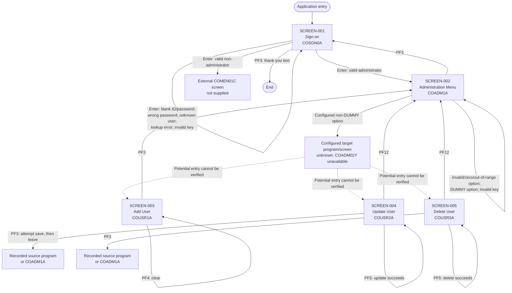

# Application Screen Flow Documentation

## Summary

- **Total screens analyzed:** 5 map-backed screens in the five supplied COBOL programs.
- **Application purpose:** The supplied portion of CardDemo supports sign-on and administration of user-security records: adding, looking up/updating, and looking up/deleting users. The stated program functions establish this scope. [COSGN00C.cbl:2-5] [COADM01C.cbl:2-5] [COUSR01C.cbl:2-5] [COUSR02C.cbl:2-5] [COUSR03C.cbl:2-5]
- **Main verified workflows:**
  - Sign on, then proceed by user type: administrator to the administration menu; non-administrator to external program `COMEN01C` (its screen is outside the supplied source). [COSGN00C.cbl:211-240]
  - Select an available administration-menu option; the selected program is determined by an unavailable configuration copybook. [COADM01C.cbl:117-155]
  - Add a user on `COUSR1A`; clear the form, return to the administration menu, or resolve a validation/save error on the same screen. [COUSR01C.cbl:83-103] [COUSR01C.cbl:117-160] [COUSR01C.cbl:250-295]
  - Look up and update a user on `COUSR2A`; a successful lookup instructs the user to press PF5 to save. [COUSR02C.cbl:145-172] [COUSR02C.cbl:333-353] [COUSR02C.cbl:368-390]
  - Look up and delete a user on `COUSR3A`; a successful lookup instructs the user to press PF5 to delete. [COUSR03C.cbl:144-169] [COUSR03C.cbl:280-300] [COUSR03C.cbl:313-336]

### Evidence boundary and confidence

**Verified facts** in this document come only from the five supplied COBOL programs: map names, mapset names, map fields referenced by program logic, function-key handling, displayed messages, data sources, and program transfers. Every such statement has a file-and-line citation.

**Unavailable BMS metadata:** The repository contains no BMS source or generated map copybooks; each program references its map copybook with `COPY` (`COSGN00`, `COADM01`, `COUSR01`, `COUSR02`, `COUSR03`), but those files are not present. [COSGN00C.cbl:48-58] [COADM01C.cbl:50-61] [COUSR01C.cbl:46-56] [COUSR02C.cbl:49-68] [COUSR03C.cbl:49-68] Consequently, the following are **not verified and are deliberately not reconstructed**: screen layout, labels, coordinates, lengths, colors (other than program-selected message status), field protection/editability, mandatory attributes, default text, cursor positions beyond explicitly set focus, PF-key legends, and the complete BMS field inventory. “Input” below means that the program receives the named field; “Output” means that the program populates it. It does not claim a BMS attribute.

`COADM02Y`, which supplies the administration option count, names, and target program names, is also absent. Therefore individual menu choices and their destinations cannot be named from this source set. [COADM01C.cbl:50-53] [COADM01C.cbl:127-155] The externally transferred `COMEN01C` program is likewise not one of the five supplied programs. [COSGN00C.cbl:230-239]

## Screen Inventory

| Screen ID | BMS Map | Program | Transaction | Purpose | Evidence |
|---|---|---|---|---|---|
| SCREEN-001 | `COSGN0A` | `COSGN00C` | `CC00` | Sign-on | [COSGN00C.cbl:35-38] [COSGN00C.cbl:110-115] [COSGN00C.cbl:151-157] |
| SCREEN-002 | `COADM1A` | `COADM01C` | `CA00` | Administration menu for administrator users | [COADM01C.cbl:35-38] [COADM01C.cbl:179-197] |
| SCREEN-003 | `COUSR1A` | `COUSR01C` | `CU01` | Add a regular or administrator user | [COUSR01C.cbl:2-6] [COUSR01C.cbl:35-38] [COUSR01C.cbl:190-209] |
| SCREEN-004 | `COUSR2A` | `COUSR02C` | `CU02` | Look up and update a user | [COUSR02C.cbl:2-6] [COUSR02C.cbl:35-38] [COUSR02C.cbl:272-291] |
| SCREEN-005 | `COUSR3A` | `COUSR03C` | `CU03` | Look up and delete a user | [COUSR03C.cbl:2-6] [COUSR03C.cbl:35-38] [COUSR03C.cbl:219-238] |

## Detailed Screen Analysis

### SCREEN-001: Sign-on (`COSGN0A`)

**Screen Purpose:** Lets a user enter credentials. A verified match routes an administrator to the administration menu and any other user type to the externally supplied `COMEN01C`; the latter’s screen behavior is unavailable here. [COSGN00C.cbl:211-240]

**User Interaction Flow:**

1. A new visit initializes the map, places focus on `USERID`, and displays the sign-on screen. [COSGN00C.cbl:80-83] [COSGN00C.cbl:151-157]
2. The user enters a user ID and password and presses Enter. The program receives `COSGN0A`. [COSGN00C.cbl:85-87] [COSGN00C.cbl:110-115]
3. If either value is blank, the screen stays open with “Please enter User ID ...” or “Please enter Password ...”; the matching field receives focus. [COSGN00C.cbl:117-127]
4. If both values are supplied, the program uppercases them and looks up the ID in `USRSEC`. [COSGN00C.cbl:132-140] [COSGN00C.cbl:211-219]
5. A matching password sends an administrator to SCREEN-002; another user type is transferred to `COMEN01C`, outside this analysis. [COSGN00C.cbl:221-240]
6. A wrong password, absent user, or lookup failure leaves the user on this sign-on screen with the stated message and focus on Password or User ID. [COSGN00C.cbl:241-256]
7. PF3 replaces the map with the “thank you” text and ends the interaction; a key other than Enter or PF3 redisplays the sign-on screen with the invalid-key message. [COSGN00C.cbl:85-95] [COSGN00C.cbl:164-172]

**Screen Fields:**

| Field Name | Type | Data Source | Description / validation |
|---|---|---|---|
| `USERID` | Input | User entry; looked up as the key in `USRSEC` | Required; blank values produce “Please enter User ID ...”. The value is uppercased before lookup. [COSGN00C.cbl:117-122] [COSGN00C.cbl:132-140] [COSGN00C.cbl:211-219] |
| `PASSWD` | Input | User entry; compared with the stored `USRSEC` password | Required; blank values produce “Please enter Password ...”. The value is uppercased before comparison. [COSGN00C.cbl:123-127] [COSGN00C.cbl:135-140] [COSGN00C.cbl:221-245] |
| `ERRMSG` | Output | Program message | Displays validation, authentication, or invalid-key feedback. [COSGN00C.cbl:77-78] [COSGN00C.cbl:89-94] [COSGN00C.cbl:149-157] |
| `TITLE01`, `TITLE02`, `TRNNAME`, `PGMNAME`, `CURDATE`, `CURTIME`, `APPLID`, `SYSID` | Output | Application constants, program/transaction IDs, current date/time, and system assignments | Header information populated before each display. Exact BMS labels, placement, and visibility are unavailable. [COSGN00C.cbl:179-204] |

**Navigation Conditions:**

- `COSGN0A` → Enter with valid administrator credentials → `COADM1A` / SCREEN-002. [COSGN00C.cbl:221-234]
- `COSGN0A` → Enter with valid non-administrator credentials → external `COMEN01C` screen (not available in supplied source). [COSGN00C.cbl:235-239]
- `COSGN0A` → Enter with blank User ID or Password, wrong password, unknown user, or lookup error → `COSGN0A` (message and focus). [COSGN00C.cbl:117-127] [COSGN00C.cbl:241-256]
- `COSGN0A` → PF3 → End / thank-you text, not another map. [COSGN00C.cbl:88-90] [COSGN00C.cbl:164-172]
- `COSGN0A` → Any other key → `COSGN0A` (invalid-key message). [COSGN00C.cbl:91-94]

### SCREEN-002: Administration Menu (`COADM1A`)

**Screen Purpose:** Provides an administrator menu. Its option rows are built from the unavailable `COADM02Y` configuration, so their labels, count, and exact program targets are not verifiable in this repository. [COADM01C.cbl:224-263] [COADM01C.cbl:50-53]

**User Interaction Flow:**

1. On first entry, the program initializes and displays `COADM1A`. [COADM01C.cbl:82-90] [COADM01C.cbl:172-184]
2. The program builds up to ten displayed option outputs from configured option number and name data. [COADM01C.cbl:226-263]
3. The user enters an option and presses Enter. The program receives `OPTION`, trims it, converts spaces to zeroes, and checks that it is numeric, non-zero, and no greater than the configured option count. [COADM01C.cbl:117-133] [COADM01C.cbl:191-197]
4. An invalid option stays on the menu and displays “Please enter a valid option number...”. [COADM01C.cbl:127-134]
5. A valid option whose configured target is not marked `DUMMY` transfers to that configured program. The destination screen cannot be established without `COADM02Y` and the target program source. [COADM01C.cbl:137-145]
6. A valid option marked `DUMMY` stays on the menu with “This option is coming soon ...”. [COADM01C.cbl:137-155]
7. PF3 returns to the sign-on program; any other unsupported key leaves the user on the menu with an invalid-key message. [COADM01C.cbl:93-103] [COADM01C.cbl:160-167]

**Screen Fields:**

| Field Name | Type | Data Source | Description / validation |
|---|---|---|---|
| `OPTION` | Input / program-formatted output | User entry; numeric value is copied to output | Must be numeric, non-zero, and within the configured administration-option count. BMS input/output field characteristics are unavailable. [COADM01C.cbl:117-133] |
| `OPTN001`–`OPTN010` | Output | Unavailable `COADM02Y` option number and name configuration | Up to ten formatted option lines are loaded. Their actual text and whether all ten exist are unavailable. [COADM01C.cbl:226-263] |
| `ERRMSG` | Output | Program message | Displays invalid option/key feedback or the “coming soon” message. [COADM01C.cbl:79-80] [COADM01C.cbl:101-102] [COADM01C.cbl:131-133] [COADM01C.cbl:147-154] |
| `TITLE01`, `TITLE02`, `TRNNAME`, `PGMNAME`, `CURDATE`, `CURTIME` | Output | Application constants, program/transaction IDs, and current date/time | Header information populated before display. [COADM01C.cbl:202-221] |

**Navigation Conditions:**

- `COADM1A` → Enter with invalid, zero, blank, nonnumeric, or out-of-range option → `COADM1A` (valid-option message). [COADM01C.cbl:117-134]
- `COADM1A` → Enter with configured non-`DUMMY` option → configured program / screen **unknown from supplied source**. [COADM01C.cbl:137-145]
- `COADM1A` → Enter with configured `DUMMY` option → `COADM1A` (“coming soon” message). [COADM01C.cbl:137-155]
- `COADM1A` → PF3 → `COSGN0A` / SCREEN-001. [COADM01C.cbl:96-98] [COADM01C.cbl:160-167]
- `COADM1A` → Unsupported key → `COADM1A` (invalid-key message). [COADM01C.cbl:99-103]

### SCREEN-003: Add User (`COUSR1A`)

**Screen Purpose:** Adds a new regular or administrator user record to `USRSEC`. [COUSR01C.cbl:2-6] [COUSR01C.cbl:240-248]

**User Interaction Flow:**

1. On first entry, the program clears the map, focuses `FNAME`, and displays the add-user screen. [COUSR01C.cbl:83-87] [COUSR01C.cbl:184-196]
2. The user supplies first name, last name, user ID, password, and user type, then presses Enter. [COUSR01C.cbl:89-92] [COUSR01C.cbl:117-160]
3. If a required value is blank, the screen stays open with a field-specific message and focus on that field. [COUSR01C.cbl:117-147]
4. If all values are supplied, the program writes the record to `USRSEC`. [COUSR01C.cbl:153-160] [COUSR01C.cbl:240-248]
5. A successful save clears all entered values and redisplays the screen with “User [ID] has been added ...”. A duplicate ID or other failure stays on the screen with an error message. [COUSR01C.cbl:250-274] [COUSR01C.cbl:287-295]
6. PF4 clears the form. PF3 returns to SCREEN-002. Any unsupported key keeps the user on this screen. [COUSR01C.cbl:90-103] [COUSR01C.cbl:279-295]

**Screen Fields:**

| Field Name | Type | Data Source | Description / validation |
|---|---|---|---|
| `FNAME` | Input | User entry; stored as `SEC-USR-FNAME` in `USRSEC` | Required; focus starts here and returns here after a general save failure. [COUSR01C.cbl:85-87] [COUSR01C.cbl:117-123] [COUSR01C.cbl:154-159] [COUSR01C.cbl:269-273] |
| `LNAME` | Input | User entry; stored as `SEC-USR-LNAME` in `USRSEC` | Required. [COUSR01C.cbl:124-129] [COUSR01C.cbl:155-159] |
| `USERID` | Input | User entry; stored as `SEC-USR-ID`, the `USRSEC` record key | Required; duplicate records return focus here. [COUSR01C.cbl:130-135] [COUSR01C.cbl:153-159] [COUSR01C.cbl:240-266] |
| `PASSWD` | Input | User entry; stored as `SEC-USR-PWD` in `USRSEC` | Required. [COUSR01C.cbl:136-141] [COUSR01C.cbl:157-159] |
| `USRTYPE` | Input | User entry; stored as `SEC-USR-TYPE` in `USRSEC` | Required; allowed values are not defined in the supplied source. [COUSR01C.cbl:142-147] [COUSR01C.cbl:158-159] |
| `ERRMSG` | Output | Program message | Displays required-field, duplicate-ID, general failure, success, or invalid-key messages. [COUSR01C.cbl:75-76] [COUSR01C.cbl:117-147] [COUSR01C.cbl:250-274] |
| `TITLE01`, `TITLE02`, `TRNNAME`, `PGMNAME`, `CURDATE`, `CURTIME` | Output | Application constants, program/transaction IDs, and current date/time | Header information populated before display. [COUSR01C.cbl:214-233] |

**Navigation Conditions:**

- `COUSR1A` → Enter with all required values and successful add → `COUSR1A` (cleared form and success message). [COUSR01C.cbl:250-259] [COUSR01C.cbl:287-295]
- `COUSR1A` → Enter with a blank required field, duplicate User ID, or write failure → `COUSR1A` (message and focus). [COUSR01C.cbl:117-147] [COUSR01C.cbl:260-273]
- `COUSR1A` → PF3 → `COADM1A` / SCREEN-002. [COUSR01C.cbl:93-95] [COUSR01C.cbl:165-178]
- `COUSR1A` → PF4 → `COUSR1A` (clear form). [COUSR01C.cbl:96-97] [COUSR01C.cbl:279-295]
- `COUSR1A` → Unsupported key → `COUSR1A` (invalid-key message). [COUSR01C.cbl:98-102]

### SCREEN-004: Update User (`COUSR2A`)

**Screen Purpose:** Finds an existing user and lets an administrator update that user’s details. [COUSR02C.cbl:2-6] [COUSR02C.cbl:322-331] [COUSR02C.cbl:360-366]

**User Interaction Flow:**

1. On first entry, the program clears the display and places the cursor on the user ID. If another screen supplied a selected user ID, it loads that ID and performs a lookup before the normal first display. **Observed legacy behavior:** the lookup itself displays a result and the first-entry path then displays the screen again unconditionally, so this preselected-ID route performs two sends. The upstream selection screen is not supplied. [COUSR02C.cbl:95-105] [COUSR02C.cbl:166-172] [COUSR02C.cbl:333-353]
2. The user enters a user ID and presses Enter. The ID is required; the program clears the other displayed details and looks up the user in `USRSEC`. [COUSR02C.cbl:145-164] [COUSR02C.cbl:322-331]
3. A successful lookup fills in first name, last name, password, and user type, then invites the user to press PF5 to save changes. [COUSR02C.cbl:166-172] [COUSR02C.cbl:333-339]
4. **Intended lookup-failure path:** a missing user shows “User ID NOT found...” and returns focus to User ID; another lookup failure shows “Unable to lookup User...”. [COUSR02C.cbl:340-352]
5. The user changes one or more details and presses PF5. All five listed values must be present; the program only attempts to save when at least one of the four changeable details differs from the data read. **Observed legacy behavior for an unknown ID on PF5:** after the lookup reports “User ID NOT found...”, the code does not stop before comparing and possibly issuing the rewrite. That later operation can overwrite the lookup message with “Unable to Update User...” (or its own not-found message), rather than preserving the intended lookup result. [COUSR02C.cbl:179-243] [COUSR02C.cbl:340-353] [COUSR02C.cbl:360-390]
6. A successful update redisplays this screen with a success message. No change, required-value errors, and save-operation errors keep the user here with feedback and, where programmed, focus. [COUSR02C.cbl:179-243] [COUSR02C.cbl:368-390]
7. PF4 clears the display. **PF3 first attempts the same save/validation routine as PF5, then unconditionally transfers to the recorded source program (or SCREEN-002 if none is recorded).** Any validation or save message sent during that attempt can therefore be discarded by the immediate transfer rather than remaining visible. PF12 always returns to SCREEN-002 without that save attempt. [COUSR02C.cbl:111-126] [COUSR02C.cbl:175-245] [COUSR02C.cbl:248-261] [COUSR02C.cbl:393-411]

**Screen Fields:**

| Field Name | Type | Data Source | Description / validation |
|---|---|---|---|
| `USRIDIN` | Input | User entry or a user selected on an upstream screen; `USRSEC` record key | Required to find or save a user. It receives focus for blank/not-found ID errors. [COUSR02C.cbl:98-104] [COUSR02C.cbl:145-163] [COUSR02C.cbl:179-185] [COUSR02C.cbl:340-345] |
| `FNAME` | Input / output | Loaded from and saved to `SEC-USR-FNAME` in `USRSEC` | Required when PF5 saves; compared with stored value to detect a change. [COUSR02C.cbl:158-170] [COUSR02C.cbl:186-191] [COUSR02C.cbl:219-222] |
| `LNAME` | Input / output | Loaded from and saved to `SEC-USR-LNAME` in `USRSEC` | Required when PF5 saves; compared with stored value to detect a change. [COUSR02C.cbl:159-170] [COUSR02C.cbl:192-197] [COUSR02C.cbl:223-226] |
| `PASSWD` | Input / output | Loaded from and saved to `SEC-USR-PWD` in `USRSEC` | Required when PF5 saves; compared with stored value to detect a change. Whether the BMS masks it is unavailable. [COUSR02C.cbl:160-170] [COUSR02C.cbl:198-203] [COUSR02C.cbl:227-230] |
| `USRTYPE` | Input / output | Loaded from and saved to `SEC-USR-TYPE` in `USRSEC` | Required when PF5 saves; compared with stored value to detect a change. Permitted values are unavailable. [COUSR02C.cbl:161-170] [COUSR02C.cbl:204-209] [COUSR02C.cbl:231-234] |
| `ERRMSG` | Output | Program message | Shows lookup instructions, validation, no-change, success, and error feedback. [COUSR02C.cbl:87-88] [COUSR02C.cbl:239-242] [COUSR02C.cbl:336-352] [COUSR02C.cbl:368-390] |
| `TITLE01`, `TITLE02`, `TRNNAME`, `PGMNAME`, `CURDATE`, `CURTIME` | Output | Application constants, program/transaction IDs, and current date/time | Header information populated before display. [COUSR02C.cbl:296-315] |

**Navigation Conditions:**

- `COUSR2A` → Enter with a found User ID → `COUSR2A` (details shown; prompt to use PF5). [COUSR02C.cbl:145-172] [COUSR02C.cbl:333-339]
- `COUSR2A` → Enter with blank, not-found, or lookup-failure User ID → `COUSR2A` (intended message and focus). [COUSR02C.cbl:145-151] [COUSR02C.cbl:340-352]
- `COUSR2A` → PF5 with missing values or no changes → `COUSR2A` (message and focus where programmed). [COUSR02C.cbl:179-243]
- `COUSR2A` → PF5 with an unknown ID → `COUSR2A`; **observed:** the not-found lookup message may be replaced by the later rewrite outcome, including “Unable to Update User...”. [COUSR02C.cbl:215-243] [COUSR02C.cbl:340-353] [COUSR02C.cbl:360-390]
- `COUSR2A` → PF5 with a changed, found user and successful save → `COUSR2A` (success message). [COUSR02C.cbl:215-237] [COUSR02C.cbl:368-376]
- `COUSR2A` → PF3 → attempts the PF5 validation/save routine, then unconditionally transfers to the recorded source program, or `COADM1A` / SCREEN-002 when no source is recorded; any intervening message may not remain visible. [COUSR02C.cbl:111-119] [COUSR02C.cbl:175-245] [COUSR02C.cbl:248-261]
- `COUSR2A` → PF4 → `COUSR2A` (clear form). [COUSR02C.cbl:120-121] [COUSR02C.cbl:393-411]
- `COUSR2A` → PF12 → `COADM1A` / SCREEN-002. [COUSR02C.cbl:124-126] [COUSR02C.cbl:248-261]
- `COUSR2A` → Unsupported key → `COUSR2A` (invalid-key message). [COUSR02C.cbl:127-130]

### SCREEN-005: Delete User (`COUSR3A`)

**Screen Purpose:** Finds an existing user and lets an administrator delete that user. [COUSR03C.cbl:2-6] [COUSR03C.cbl:269-278] [COUSR03C.cbl:307-311]

**User Interaction Flow:**

1. On first entry, the program clears the display and places the cursor on the user ID. If another screen supplied a selected user ID, it loads that ID and performs a lookup before the normal first display. **Observed legacy behavior:** the lookup displays a result and the first-entry path then displays the screen again unconditionally, so this preselected-ID route performs two sends. That upstream selection screen is not supplied. [COUSR03C.cbl:95-105] [COUSR03C.cbl:164-169] [COUSR03C.cbl:280-300]
2. The user enters a user ID and presses Enter. The ID is required, and the program looks up the user in `USRSEC`. [COUSR03C.cbl:144-162] [COUSR03C.cbl:269-278]
3. A successful lookup fills in first name, last name, and user type, then invites the user to press PF5 to delete that user. [COUSR03C.cbl:164-169] [COUSR03C.cbl:280-286]
4. **Intended lookup-failure path:** a missing user shows “User ID NOT found...” and returns focus to User ID; another lookup failure shows “Unable to lookup User...”. [COUSR03C.cbl:287-300]
5. The user presses PF5. A blank ID is rejected; otherwise the program reads the record and then issues the delete. **Observed legacy behavior for an unknown ID on PF5:** after the lookup reports “User ID NOT found...”, the code does not stop before issuing the delete. The later delete result can replace the lookup message. In the generic failure branch, the displayed legacy text is “Unable to Update User...” even though this is a deletion request. [COUSR03C.cbl:176-192] [COUSR03C.cbl:287-300] [COUSR03C.cbl:307-336]
6. A successful delete clears the values and redisplays the screen with a success message. Other delete-operation errors keep the user on this screen with a message. [COUSR03C.cbl:313-336] [COUSR03C.cbl:349-356]
7. PF4 clears the display; PF3 returns to the recorded source program (or SCREEN-002 if none is recorded); PF12 returns to SCREEN-002. [COUSR03C.cbl:111-125] [COUSR03C.cbl:195-208] [COUSR03C.cbl:339-356]

**Screen Fields:**

| Field Name | Type | Data Source | Description / validation |
|---|---|---|---|
| `USRIDIN` | Input | User entry or a user selected on an upstream screen; `USRSEC` record key | Required to find or delete a user. It receives focus for blank/not-found ID errors. [COUSR03C.cbl:98-104] [COUSR03C.cbl:144-161] [COUSR03C.cbl:176-190] [COUSR03C.cbl:287-292] |
| `FNAME` | Output | `SEC-USR-FNAME` from `USRSEC` | Loaded after a successful lookup. The BMS editability is unavailable. [COUSR03C.cbl:157-168] |
| `LNAME` | Output | `SEC-USR-LNAME` from `USRSEC` | Loaded after a successful lookup. The BMS editability is unavailable. [COUSR03C.cbl:157-168] |
| `USRTYPE` | Output | `SEC-USR-TYPE` from `USRSEC` | Loaded after a successful lookup. The BMS editability and permitted values are unavailable. [COUSR03C.cbl:157-168] |
| `ERRMSG` | Output | Program message | Shows lookup instructions, validation, successful deletion, and errors. [COUSR03C.cbl:87-88] [COUSR03C.cbl:283-299] [COUSR03C.cbl:313-335] |
| `TITLE01`, `TITLE02`, `TRNNAME`, `PGMNAME`, `CURDATE`, `CURTIME` | Output | Application constants, program/transaction IDs, and current date/time | Header information populated before display. [COUSR03C.cbl:243-262] |

**Navigation Conditions:**

- `COUSR3A` → Enter with a found User ID → `COUSR3A` (details shown; prompt to use PF5). [COUSR03C.cbl:144-169] [COUSR03C.cbl:280-286]
- `COUSR3A` → Enter with blank, not-found, or lookup-failure User ID → `COUSR3A` (intended message and focus). [COUSR03C.cbl:144-150] [COUSR03C.cbl:287-300]
- `COUSR3A` → PF5 with a blank ID → `COUSR3A` (message and focus). [COUSR03C.cbl:176-186]
- `COUSR3A` → PF5 with an unknown ID → `COUSR3A`; **observed:** the not-found lookup message may be replaced by the subsequent delete outcome, including the legacy generic text “Unable to Update User...”. [COUSR03C.cbl:188-192] [COUSR03C.cbl:287-300] [COUSR03C.cbl:307-336]
- `COUSR3A` → PF5 with a found user and successful delete → `COUSR3A` (cleared form and success message). [COUSR03C.cbl:188-192] [COUSR03C.cbl:313-322] [COUSR03C.cbl:349-356]
- `COUSR3A` → PF3 → recorded source program, or `COADM1A` / SCREEN-002 when no source is recorded. [COUSR03C.cbl:111-118] [COUSR03C.cbl:195-208]
- `COUSR3A` → PF4 → `COUSR3A` (clear form). [COUSR03C.cbl:119-120] [COUSR03C.cbl:339-356]
- `COUSR3A` → PF12 → `COADM1A` / SCREEN-002. [COUSR03C.cbl:123-125] [COUSR03C.cbl:195-208]
- `COUSR3A` → Unsupported key → `COUSR3A` (invalid-key message). [COUSR03C.cbl:126-129]

## Complete Application Flow

### Flow interpretation

Solid arrows are verified program transfers or verified stay-on-screen outcomes. The dotted arrows to Add, Update, and Delete are intentionally **not assertions of navigation**: these programs exist in the supplied source, but `COADM01C` delegates option-to-program mapping to unavailable `COADM02Y`. The complete flow therefore preserves that unknown configuration boundary rather than inventing menu options. [COADM01C.cbl:137-145] [COADM01C.cbl:224-263]

The return target for PF3 on Update and Delete is context-sensitive: it is the recorded originating program when present and `COADM01C` otherwise. On Update, PF3 is not a simple return: it calls the update/save routine before the unconditional transfer, so any message from that routine may not remain on screen. The actual screen behind a non-empty recorded origin is not determinable from the supplied programs. [COUSR02C.cbl:111-119] [COUSR02C.cbl:175-245] [COUSR03C.cbl:111-118]
